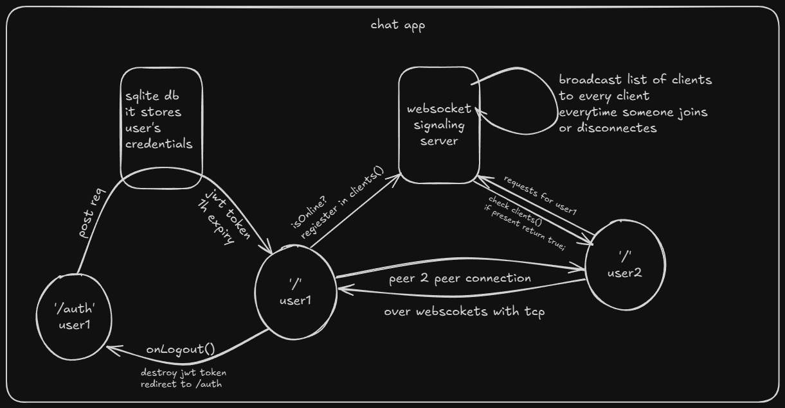
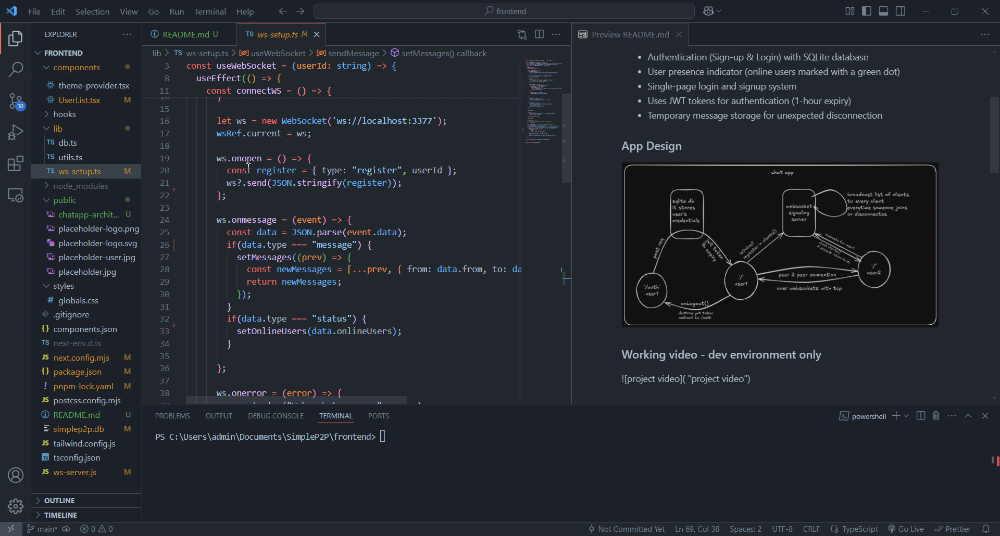

# WebSocket Chat App

This is a simple WebSocket-based chat application built using Next.js 14 with TypeScript. It features authentication and a single WebSocket server running on Node.js. Both the Next.js app and the WebSocket server run concurrently, making it ideal for development use.

## Features
- Full Next.js 14 application with TypeScript
- WebSocket-based real-time chat
- Authentication (Sign-up & Login) with SQLite database
- User presence indicator (online users marked with a green dot)
- Single-page login and signup system
- Uses JWT tokens for authentication (1-hour expiry)
- Temporary message storage for unexpected disconnection

### App Design


### Working video - dev environment only
Here I am logging in from 2 different accounts in 2 different browsers locally, which after logging in are registered in our signaling server and hence can chat with each other.



## Tech Stack & Libraries
This project uses the following libraries:

- **Next.js 14** (with TypeScript)
- **SQLite** (for user data storage)
- **WebSockets** (`ws` for the server)
- **Tailwind CSS** (for styling)
- **Radix UI** (for UI components)
- **React Hook Form** (for form handling)
- **jsonwebtoken & jwt-decode** (for handling JWT authentication)
- **Concurrently** (to run Next.js and WebSocket server together)

### Disclaimer
Some of the Radix UI components and template parts in this project are not originally created by me, but are directly sourced from the web. However, all core files required to run this project have been developed by me.

### Files I’ve Worked On
- core serverside websocket - [ws-server.js](ws-server.js)
- client side websocket setup - [ws-setup.ts](lib\ws-setup.ts)
- database setup - [db.ts](lib\db.ts)
- user list as component - [UserList.tsx](components\UserList.tsx)
- Home page - [home page](app\page.tsx), [auth page](app\auth\page.tsx), [api/auth](app\api\auth\route.ts), [api/users](app\api\users\route.ts)


## Setup & Installation

1. Clone the repository:
   ```sh
   git clone git@github.com:Phaedrus1301/SimpleP2P.git
   cd SimpleP2P
   ```

2. Install dependencies:
   ```sh
   npm install
   ```
   Please note that I have used pnpm for those whole development process.

3. Run the development environment:
   ```sh
   npm run dev
   ```
   This runs both the Next.js app and the WebSocket server concurrently.

## Notes
- This project is only intended to be fully functional in a development environment.
- The authentication system stores user credentials in an SQLite database.
- WebSocket connections are established between users using `userId` instead of JWT authentication for simplicity.
- Since this is a quick and simple project, some security measures have been skipped. For example, JWT tokens and user IDs are stored in localStorage instead of using a more secure approach. This is not recommended for production.

## License
MIT

